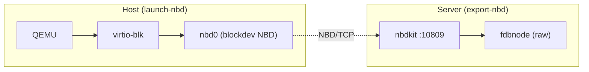
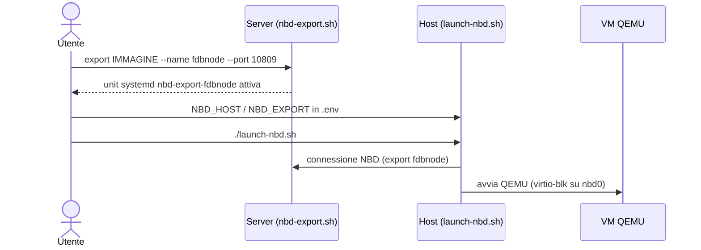

# nbd

Progetto NBD (Network Block Device) ha due componenti: un server che esporta
dischi raw via `nbdkit` e un launcher QEMU che avvia una VM bootando da
quell'esportazione in rete.



## Componenti

### `export-nbd/` — server (nbdkit, ruolo server)

Script unico `nbd-export.sh`: crea file immagine ed esporta file/block
device come servizi **systemd** (`nbd-export-<name>.service`), senza file
di configurazione (l'unità generata è lo stato). Supporta filtri (`limit`,
`multi-conn`, `luks`, `ip`, …), `--readonly`, TLS, e un modello di privilegi
per tipo di sorgente. Host di riferimento: Odroid aarch64 (Ubuntu, nbdkit 1.36).

```bash
./nbd-export.sh export disk.img --name fdbnode --port 10809
./nbd-export.sh list | status | start | stop | remove ...
```

### `launch-nbd/` — client (QEMU, repo git a sé)

`launch-nbd.sh` avvia una VM QEMU il cui disco raw vive sull'export NBD del
server (`NBD_HOST:NBD_PORT`, export `NBD_EXPORT` — di default `fdbnode`).
La connessione NBD la fa QEMU lato host: il guest vede un normale disco
`virtio-blk`, senza rete speciale nel guest. Gestisce firmware UEFI/OVMF,
ISO di installazione (download + SHA256), overlay/snapshot locali qcow2,
display (spice/gtk/vnc), rete (dual/nat/tap/bridged), audio, cache/AIO.
Configurazione in `.env` (copia di `.env.example`).

```bash
./launch-nbd.sh                 # boot dal disco NBD
./launch-nbd.sh --overlay       # overlay locale sopra l'NBD
./launch-nbd.sh --iso <file|URL>
```

## Flusso tipico



1. Sul server: `nbd-export.sh export <immagine> --name fdbnode --port 10809`
2. Sull'host: imposta `NBD_HOST`/`NBD_EXPORT` in `launch-nbd/.env`
3. Avvia la VM con `launch-nbd/launch-nbd.sh`

## Stato di commit cross-host (.status)

Per proteggersi da commit qcow2 interrotti (disco ibrido), il server espone lo stato di
commit di ogni export: file binari `<name>.status` (4 KiB) serviti dall'unit
`nbd-export-state.service` su `nbd://HOST:10819/<name>.status`. Il launcher client legge
il marker prima di toccare il disco e si ferma se lo trova `committing`.

- Formato dei file: `docs/status-format.md` (contratto canonico)
- Gestione lato server: `nbd-export.sh state init|export|set|show|remove` (dettagli in `export-nbd/AGENT.md`)
- Contratto lato client: `launch-nbd/docs/plan-go.md` §5.10
