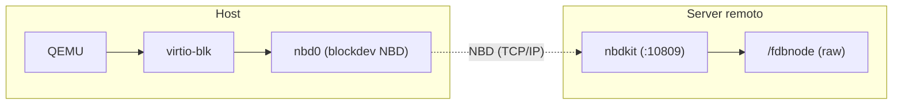

# fdbnode

Avvio di una VM QEMU il cui disco raw vive in rete, servito come
esportazione NBD da `nbdkit` su un host remoto (`server:10809`).

Lo script `launch-nbd.sh` è un launcher completo: gestisce firmware
UEFI, download e verifica delle ISO, modalità di rete, display, audio e
caching del disco NBD — con poche opzioni da riga di comando.

## Come funziona

La connessione NBD è stabilita dal processo QEMU **lato host**: il guest vede
semplicemente un normale disco `virtio-blk` locale, quindi non è necessario
alcun setup di rete speciale dentro la macchina virtuale.



In modalità *overlay* si inserisce un livello locale `qcow2` tra QEMU e il
disco NBD: le scritture restano in locale finché non vengono committate.

## Requisiti

- **Lato host:** QEMU ≥ 10 (`qemu-system-x86_64`), `qemu-img` (solo per
  overlay/snapshot/commit), `curl` (solo con `--iso <URL>`), `remote-viewer`
  o `virt-viewer` (per `--display spice`)
- **Accelerazione:** KVM se disponibile (`/dev/kvm`), altrimenti fallback
  automatico su TCG (lento)
- **Lato server:** un host raggiungibile con `nbdkit` che serve l'esportazione
  `fdbnode` (raw) sulla porta 10809; l'host si configura in `.env` (`NBD_HOST`)

Suggerito lato server (`nbdkit`): i filtri `cache` e `readahead` esistono,
ma le osservazioni di nbdkit indicano che il caching lato client è di solito
più efficace — ed è ciò che questo script fa.

## Utilizzo rapido

```bash
# Avvia il sistema installato dal disco NBD
./launch-nbd.sh

# Installa una distro da una ISO (URL => download con ripresa + verifica SHA256)
./launch-nbd.sh --iso https://example.com/distro.iso

# Usa una ISO locale
./launch-nbd.sh --iso ./distro.iso

# Overlay locale persistente: le scritture restano in locale finché non le committi
./launch-nbd.sh --overlay
./launch-nbd.sh --commit            # riporta l'overlay sul disco NBD

# Overlay usa-e-getta: le scritture vengono scartate all'uscita
./launch-nbd.sh --snapshot

# In background / con inoltro di porta
./launch-nbd.sh --daemon
./launch-nbd.sh --port tcp:2222:22
```

L'overlay in corso può essere committato anche a VM accesa dal monitor HMP:

```text
(monitor) block-commit disk0
```

## Opzioni

| Opzione | Descrizione |
|---|---|
| `--iso <file\|URL>` | ISO di installazione/live. Con URL: download riprendibile (`curl -C -`), verifica SHA256 e il CD-ROM boota per primo |
| `--overlay` | `qcow2` locale persistente (sopra l'NBD); le scritture restano locali fino a `--commit` |
| `--snapshot` | Overlay usa-e-getta in `/tmp`, eliminato all'uscita (prevale su `--overlay`) |
| `--commit` | Esegue `qemu-img commit` dell'overlay verso il disco NBD, poi esce (nessuna VM deve usare l'overlay!) |
| `--cache <mode>` | `writeback` (default) \| `none` \| `unsafe` \| `writethrough` \| `directsync` |
| `--aio <mode>` | `io_uring` (default) \| `native` \| `threads` |
| `--no-reconnect` | Disabilita la riconnessione automatica alle interruzioni NBD (`reconnect-delay=0`) |
| `--display <mode>` | `spice` (default) \| `gtk` \| `sdl` \| `vnc` \| `none` \| `auto`. `--vnc` è un alias per `--display vnc` |
| `--vga <mode>` | `virtio` (default) \| `std` \| `qxl` \| `vmware` \| `none` (virtio-gpu = prestazioni migliori) |
| `--gl on\|off` | Accelerazione 3D virgl (solo con `--vga virtio`; di default automatica) |
| `--audio <mode>` | `hda` (default) \| `virtio` \| `none` (backend host: pipewire → pulseaudio → nessuno) |
| `--net <mode>` | `dual` (default) \| `nat` \| `hostonly` \| `tap` \| `bridged` \| `none` |
| `--tap <dev>` | Device TAP per le modalità tap/dual (default `tap0`) |
| `--tap-subnet <cidr>` | Rete privata host↔guest (default `192.168.100.0/24`) |
| `--bridge <if>` | Bridge per `--net bridged` (default `br0`) |
| `--port <spec>` | Forward `tcp\|udp:porte` (ripetibile, es. `tcp:2222:22`) |
| `--mem <MiB>` | RAM (default `6144`) |
| `--cpus <n>` | vCPU (default `4`) |
| `--kvm` / `--tcg` | Forza l'accelerazione (default: auto) |
| `--daemon` | Avvia la VM in background |
| `--monitor` | Monitor HMP su stdio (per `block-commit`, ecc.) |
| `--monitor-socket <path>` | Monitor HMP su socket unix (es. per `system_wakeup`/`system_powerdown` remoti) |
| `--help` | Mostra l'uso |

## Rete

| Modalità | Descrizione |
|---|---|
| `dual` (default) | **Due NIC**: `ens3` NAT user-mode verso internet (`10.0.2.15`) + `ens4` rete TAP privata host↔guest: host `192.168.100.1` ↔ guest `192.168.100.2` (tutte le porte aperte, i `--port` restano comunque sulla NIC NAT) |
| `nat` | Singola NIC SLIRP: il guest ha internet via host (`10.0.2.15`) ma l'host raggiunge il guest solo con `--port` |
| `hostonly` | Rete user-mode con `restrict=on`: il guest parla solo con l'host (equivalente user-space di un adattatore host-only) |
| `tap` | Rete privata host↔guest su TAP (senza bridge né hostfwd): host `.1` ↔ guest `.2` sulla stessa subnet; `ip_forward` + MASQUERADE danno internet al guest |
| `bridged` | TAP agganciata a un bridge di host (default `br0`): il guest entra nella LAN con indirizzo proprio. Serve root o `qemu-bridge-helper` (con `allow br0` in `/etc/qemu/bridge.conf`) |
| `none` | Nessun dispositivo di rete |

Con tap/dual al primo uso vengono concessi i permessi su `/dev/net/tun` e
creato il TAP (root/sudo); tutto viene ripristinato all'uscita — tranne con
`--daemon` (pulizia manuale: `sudo ip tuntap del dev tap0`).

Nel guest, per la rete privata TAP:

```bash
ip addr add 192.168.100.2/24 dev <nettap> && ip link set <nettap> up
```

## Display e clipboard

- **`spice` (default):** server SPICE headless su `127.0.0.1:5930` con
  `remote-viewer` (o virt-viewer via flatpak) lanciato automaticamente.
  **Clipboard condiviso** host↔guest via spice-vdagent (porta virtio-serial
  `com.redhat.spice.0`)
- **`vnc`:** headless, `vncviewer 127.0.0.1:5900`
- **`gtk`/`sdl`:** finestra locale (richiede sessione grafica sull'host)
- **`none`:** completamente headless

Nota: la build QEMU di Fedora non include il clipboard GTK; per il
copia/incolla con l'host usa `--display spice`.

## Installazione di una distro

`--iso <URL>` scarica l'ISO nella directory dello script (riprendendo i file
incompleti con `curl -C -`), cerca un `SHA256SUMS`/`.sha256` nelle vicinanze
dell'URL o nella directory locale e verifica il checksum: il download viene
riavviato se incompleto/corrotto, e la VM non parte se il checksum non
combacia. Il CD-ROM ha `bootindex=0`, quindi boota prima del disco NBD.

Senza ISO si boota direttamente il sistema già installato sul disco NBD.

## Cache e prestazioni NBD

- **Modalità diretta:** QEMU apre `nbd://server:10809/fdbnode` con
  `reconnect-delay=10`s (tollera interruzioni di rete del server) e device
  `write-cache` in base al `--cache` scelto
- **Overlay:** `qcow2` locale con backing NBD, cache metadata `64 MiB`
  (`QCACHE_MB`) e L2 `16 MiB` (`L2_CACHE_MB`): i blocchi caldi si servono dal
  disco locale mentre il resto affluisce dal server
- **Iothread dedicato** (`iothread,id=io0`) per il `virtio-blk`, AIO
  `io_uring` di default

## Configurazione (`.env`)

Tutti i default stanno in `.env` (gitignorato), copia di `.env.example`;
lo script lo esegue all'avvio e i flag CLI hanno la precedenza sui suoi valori.
Oltre alle variabili sotto, anche display/vga/gl/audio, cache, aio, reconnect e
accel hanno default in `.env.example`.

| Variabile | Default | Descrizione |
|---|---|---|
| `NBD_HOST` | `server` | Host dell'esportazione NBD |
| `NBD_PORT` | `10809` | Porta NBD |
| `NBD_EXPORT` | `fdbnode` | Nome dell'export creato da nbdkit sul server |
| `NBD_URI` | `nbd://server:10809/fdbnode` | URI completo (derivato se non impostato) |
| `MEM_MB` | `6144` | RAM della VM (MiB) |
| `CPUS` | `4` | vCPU |
| `QCACHE_MB` | `64` | Cache metadata qcow2 (overlay) |
| `L2_CACHE_MB` | `16` | Cache tabelle L2 qcow2 (overlay) |
| `NET_MODE` | `dual` | Modalità di rete |
| `TAP_DEV` | `tap0` | Device TAP |
| `TAP_SUBNET` | `192.168.100.0/24` | Subnet privata host↔guest |
| `BRIDGE_IF` | `br0` | Bridge per `--net bridged` |
| `AUDIO_DRV` | `auto` | Backend audio host (pipewire/pa/sdl/none) |
| `SPICE_PORT` | `5930` | Porta del server SPICE |
| `QEMU` / `QEMU_IMG` | `qemu-system-x86_64` / `qemu-img` | Binari da usare |

## Struttura del repository

| File | Descrizione |
|---|---|
| `launch-nbd.sh` | Il launcher QEMU (tutte le opzioni sopra, `--help` incluso) |
| `.env` | Configurazione locale (gitignorata): i default della tua macchina |
| `.env.example` | Template committato dei default (copia in `.env`) |
| `OVMF_VARS.fd` | Copia scrivibile delle variabili NVRAM UEFI (creata al primo avvio da `/usr/share/edk2/ovmf/OVMF_VARS.fd` se mancante; contiene le variabili di boot) |
| `qemu-help.txt` | Output di `qemu-system-x86_64 --help` (QEMU 10.1.5, Fedora 43) tenuto come riferimento di sviluppo |
